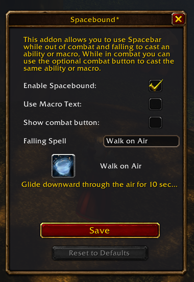
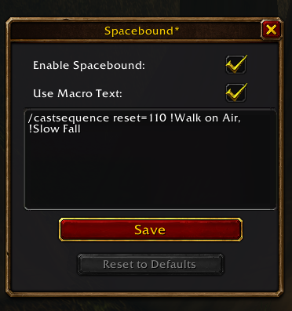

# Spacebound

A World of Warcraft **Forever** addon that lets you bind a spell or macro to your jump key without unbinding jump.

- **On the ground:** the jump key jumps, as usual.
- **While falling:** the jump key casts your chosen spell or runs your chosen macro.

Jump, then press jump again mid-air to cast a slow fall or immunity effect and avoid fall damage. Spacebound follows whatever key is bound to Jump in your keybindings, not just the spacebar.

Mages default to **Slow Fall**. Every other class can pick any spell or macro.

## Installation

Copy the `Spacebound/` folder (the inner one, containing `Spacebound.toc`) into:

```
World of Warcraft\_classic_beta_\Interface\AddOns\
```

Disable any other addon that also rebinds the jump key while falling (e.g. SlowFaller).

## Usage

| Command | Description |
|---|---|
| `/sb` or `/spacebound` | Toggle the settings window |
| `/sb spell <name or id>` | Cast this spell while falling |
| `/sb macro <text>` | Run this macro while falling (use `\n` for new lines) |
| `/sb on` / `/sb off` | Enable or disable Spacebound |
| `/sb status` | Print the current configuration |

The settings window offers the same options: an enable toggle, a spell or macro mode, a spell preview, and a Shift-click **Reset to Defaults** button.

Settings are saved per character.

| Spell mode | Macro mode |
|---|---|
|  |  |

## Limitations

- **Does not work in combat.** WoW blocks addons from changing keybindings during combat, so the jump key only jumps while you're in combat.

## Development

The addon source lives in `Spacebound/`. For editor support, use [lua-language-server](https://github.com/LuaLS/lua-language-server) with the [WoW API annotations](https://github.com/Ketho/vscode-wow-api).
